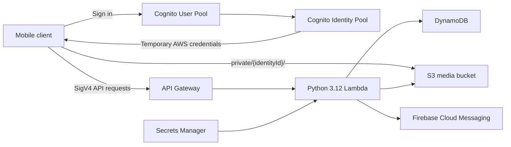

# Cloud Photos Infrastructure

[日本語](README.md) | [English](README.en.md)

This Terraform repository manages the AWS backend for a photo and video sharing application. It deploys authentication, media storage, metadata APIs, device tokens, and push notifications to separate dev and prod environments.

Infrastructure changes are validated through pull requests and applied by GitHub Actions using OIDC roles. Local `terraform apply` is not part of the normal deployment path.

## Architecture



| Service | Purpose |
|---|---|
| Amazon Cognito User Pool / Identity Pool | User authentication and temporary AWS credentials for clients |
| Amazon API Gateway | REST API protected by `AWS_IAM` authorization |
| AWS Lambda | Media metadata, device tokens, user-data deletion, and notification processing |
| Amazon DynamoDB | Upload records and device-token storage |
| Amazon S3 | Photo and video storage isolated by Cognito Identity ID |
| AWS Secrets Manager | Firebase Admin SDK service-account credentials |
| AWS KMS / S3 | Terraform state encryption, versioning, and locking |

All application resources are deployed in `ap-northeast-1`.

## API

Application endpoints require SigV4 requests signed with credentials issued by the Cognito Identity Pool. Only the CORS `OPTIONS` methods are unauthenticated.

| Method | Path | Description |
|---|---|---|
| `GET` | `/media/uploads` | List the caller's upload records |
| `POST` | `/media/uploads` | Create an upload record |
| `DELETE` | `/media/uploads/{mediaId}` | Soft-delete one of the caller's upload records |
| `POST` | `/media/uploads/complete` | Send an upload-completion FCM notification to registered devices |
| `PUT` | `/devices/token` | Register a device token |
| `DELETE` | `/devices/token` | Unregister a device token |
| `DELETE` | `/users` | Delete the caller's S3 objects, upload records, and device tokens |

## Environments

| Item | dev | prod |
|---|---|---|
| Root module | `envs/dev` | `envs/prod` |
| Deployment branch | `develop` or `main` | `main` only |
| Data protection | Destructive changes allowed for development | DynamoDB and Cognito deletion protection enabled |
| Cognito MFA | Module default | Required |
| Lambda log retention | 14 days | 90 days |
| Noncurrent S3 version retention | 30 days | 90 days |
| GitHub Environment | `development` | `production` (manual approval recommended) |

## Repository Layout

```text
bootstrap/          Terraform backend, GitHub OIDC, and plan/apply IAM roles
envs/dev/           Terraform root module for dev
envs/prod/          Terraform root module for prod
modules/            Reusable AWS resource modules
lambda/             Lambda handlers, shared code, layers, and pytest tests
.github/workflows/  Terraform CI/CD and the reusable deployment workflow
docs/               Implementation, verification, security, and operational guidance
.agents/skills/     Repository-local Skills for Codex
.claude/skills/     Repository-local Skills for Claude Code
```

## Local Development

### Prerequisites

- Terraform `1.15.6`; [.terraform-version](.terraform-version) is the source of truth
- Python `3.12`
- Docker for building the Firebase Admin Lambda Layer
- Ruff and pytest
- Optional: Trivy for IaC security scans
- AWS permissions equivalent to the target environment's `gh-terraform-plan-<env>` role and the state bucket name, only when running `terraform plan`. In addition to resource read access, planning requires KMS decryption and S3 lockfile read/write permissions

### Python environment

```powershell
python -m venv .venv
.\.venv\Scripts\Activate.ps1
python -m pip install --upgrade pip
python -m pip install -r lambda/requirements-dev.txt ruff
```

### Basic verification

```powershell
terraform fmt -check -recursive
ruff check lambda/
ruff format --check lambda/
Push-Location lambda
pytest
Pop-Location
trivy conf .
```

Terraform `validate` and `plan` require backend initialization and `.build/firebase_admin_layer.zip`. From the repository root, build the layer with the same AWS SAM Python 3.12 image used by CI.

```powershell
New-Item -ItemType Directory -Force .build | Out-Null
$repositoryRoot = (Get-Location).Path
docker run --rm `
  --mount "type=bind,source=$repositoryRoot\.build,target=/out" `
  --mount "type=bind,source=$repositoryRoot\lambda\layers\firebase_admin,target=/requirements,readonly" `
  public.ecr.aws/sam/build-python3.12:latest-x86_64 `
  bash -c "pip install -r /requirements/requirements.txt -t /tmp/python --quiet && cd /tmp && zip -r9 /out/firebase_admin_layer.zip python"
```

After building the layer, initialize and verify the target environment.

```powershell
Push-Location envs/dev
terraform init -backend-config="bucket=<STATE_BUCKET>"
terraform validate
terraform plan
Pop-Location
```

If a state lock is encountered, do not bypass it with `-lock=false` or `terraform force-unlock`. See [docs/guardrails.md](docs/guardrails.md) for the required handling.

## CI/CD

### Pull requests

When relevant paths change in a pull request targeting `main` or `develop`, CI runs:

- Terraform formatting checks
- Ruff lint and formatting checks
- Lambda unit tests
- Trivy IaC scanning with SARIF upload
- `terraform validate` and `terraform plan` for dev and prod
- Sanitized Terraform plan comments on the pull request

### Deployment

- Push to `develop`: plan dev and apply the saved plan to dev
- Push to `main`: deploy dev, then plan and apply prod through the `production` Environment
- Plan and apply use separate least-privilege OIDC roles
- Plan artifacts are retained for 90 days
- `bootstrap/` is outside the normal CD path and is applied manually for initial setup or foundation changes

## Initial Setup

1. Review `bootstrap/`, then have an administrator apply it once to create the Terraform backend, KMS key, GitHub OIDC provider, and environment-specific plan/apply roles.
2. Configure the `AWS_ACCOUNT_ID` and `TF_STATE_BUCKET` GitHub repository variables.
3. Create the `development` and `production` GitHub Environments.
4. Add required reviewers to `production` and restrict its deployment branch to `main`.
5. Protect `main` and `develop` by requiring pull requests and successful CI checks.
6. Add Firebase service-account credentials to the dev and prod Secrets Manager secrets created by Terraform through a secure channel. Never store the secret value in Terraform or Git.

## Security Principles

- GitHub Actions authenticates to AWS through OIDC; no long-lived AWS access keys are stored in CI.
- Every Lambda function has a dedicated least-privilege IAM role.
- Client S3 access is restricted to `private/{Cognito Identity ID}/`.
- API Gateway invocation permissions are restricted by method and path.
- The media bucket blocks public access and enables encryption and versioning.
- Terraform state is encrypted with KMS and uses the S3 backend lockfile.
- Secrets, AWS account IDs, PII, and raw tokens must not be committed or logged.

Report vulnerabilities through the process in the [Security Policy](SECURITY.md), not through a public issue.

## Documentation

- [Infrastructure](docs/infrastructure.md)
- [Lambda implementation](docs/lambda.md)
- [Testing](docs/testing.md)
- [Security](docs/security.md)
- [Guardrails](docs/guardrails.md)
- [Verification policy](docs/verification_policy.md)
- [Common commands](docs/commands.md)
- [Coding standards](docs/coding_standards.md)
- [Technology stack](docs/tech_stack.md)

Agent entry points are [AGENTS.md](AGENTS.md) and [CLAUDE.md](CLAUDE.md). `AGENTS.md` / `.agents/skills/` and `CLAUDE.md` / `.claude/skills/` are maintained independently, and shared changes must be applied manually to both.
