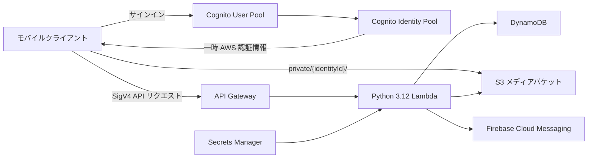

# Cloud Photos Infrastructure

[日本語](README.md) | [English](README.en.md)

写真・動画共有アプリケーションの AWS バックエンドを管理する Terraform リポジトリです。認証、メディアストレージ、メタデータ API、デバイストークン、プッシュ通知を dev / prod の2環境へデプロイします。

インフラ変更は Pull Request で検証し、GitHub Actions と OIDC ロールを通じて適用します。ローカルからの `terraform apply` は通常のデプロイ経路ではありません。

## アーキテクチャ



| サービス | 用途 |
|---|---|
| Amazon Cognito User Pool / Identity Pool | ユーザー認証と、クライアント用の一時 AWS 認証情報発行 |
| Amazon API Gateway | `AWS_IAM` 認証を使う REST API |
| AWS Lambda | メディアメタデータ、デバイストークン、ユーザーデータ削除、通知処理 |
| Amazon DynamoDB | アップロード記録とデバイストークンの保存 |
| Amazon S3 | Identity ID ごとに分離された写真・動画の保存 |
| AWS Secrets Manager | Firebase Admin SDK のサービスアカウント情報管理 |
| AWS KMS / S3 | Terraform state の暗号化、バージョニング、ロック |

リージョンは `ap-northeast-1` です。

## API

業務 API は Cognito Identity Pool が発行した認証情報による SigV4 署名が必要です。CORS 用の `OPTIONS` メソッドのみ未認証です。

| メソッド | パス | 概要 |
|---|---|---|
| `GET` | `/media/uploads` | 自分のアップロード記録を取得 |
| `POST` | `/media/uploads` | アップロード記録を作成 |
| `DELETE` | `/media/uploads/{mediaId}` | 自分のアップロード記録を論理削除 |
| `POST` | `/media/uploads/complete` | 登録端末へアップロード完了の FCM 通知を送信 |
| `PUT` | `/devices/token` | デバイストークンを登録 |
| `DELETE` | `/devices/token` | デバイストークンを解除 |
| `DELETE` | `/users` | 自分の S3 オブジェクト、アップロード記録、デバイストークンを削除 |

## 環境

| 項目 | dev | prod |
|---|---|---|
| ルートモジュール | `envs/dev` | `envs/prod` |
| 自動デプロイ元 | `develop` または `main` | `main` のみ |
| データ保護 | 開発向けに削除可能 | DynamoDB / Cognito の削除保護を有効化 |
| Cognito MFA | 既定設定 | 必須 |
| Lambda ログ保持 | 14日 | 90日 |
| S3 非現行バージョン保持 | 30日 | 90日 |
| GitHub Environment | `development` | `production`（手動承認を推奨） |

## リポジトリ構成

```text
bootstrap/          Terraform backend、GitHub OIDC、plan/apply IAM ロール
envs/dev/           dev 環境の Terraform ルートモジュール
envs/prod/          prod 環境の Terraform ルートモジュール
modules/            再利用可能な AWS リソースモジュール
lambda/             Lambda 実装、共有コード、レイヤー、pytest テスト
.github/workflows/  Terraform CI/CD と再利用可能なデプロイワークフロー
docs/               実装、検証、セキュリティ、運用ルール
.agents/skills/     Codex 向けリポジトリローカル Skills
.claude/skills/     Claude Code 向けリポジトリローカル Skills
```

## ローカル開発

### 必要なツール

- Terraform `1.15.6`（正確な値は [.terraform-version](.terraform-version) を参照）
- Python `3.12`
- Docker（Firebase Admin Lambda Layer のビルドに使用）
- Ruff、pytest
- 任意: Trivy（IaC セキュリティスキャン）
- `terraform plan` を行う場合のみ、対象環境の `gh-terraform-plan-<env>` ロール相当の AWS 権限と state bucket 名。リソースの参照に加え、state の KMS 復号と S3 lockfile の読み書き権限が必要です

### Python 環境

```powershell
python -m venv .venv
.\.venv\Scripts\Activate.ps1
python -m pip install --upgrade pip
python -m pip install -r lambda/requirements-dev.txt ruff
```

### 基本検証

```powershell
terraform fmt -check -recursive
ruff check lambda/
ruff format --check lambda/
Push-Location lambda
pytest
Pop-Location
trivy conf .
```

Terraform の `validate` / `plan` では backend の初期化に加え、`.build/firebase_admin_layer.zip` が必要です。リポジトリルートで、CI と同じ AWS SAM Python 3.12 イメージを使ってレイヤーを生成します。

```powershell
New-Item -ItemType Directory -Force .build | Out-Null
$repositoryRoot = (Get-Location).Path
docker run --rm `
  --mount "type=bind,source=$repositoryRoot\.build,target=/out" `
  --mount "type=bind,source=$repositoryRoot\lambda\layers\firebase_admin,target=/requirements,readonly" `
  public.ecr.aws/sam/build-python3.12:latest-x86_64 `
  bash -c "pip install -r /requirements/requirements.txt -t /tmp/python --quiet && cd /tmp && zip -r9 /out/firebase_admin_layer.zip python"
```

レイヤー生成後、対象環境を初期化して検証します。

```powershell
Push-Location envs/dev
terraform init -backend-config="bucket=<STATE_BUCKET>"
terraform validate
terraform plan
Pop-Location
```

state lock が発生した場合、`-lock=false` や `terraform force-unlock` で回避しないでください。詳しくは [docs/guardrails.md](docs/guardrails.md) を参照してください。

## CI/CD

### Pull Request

`main` または `develop` 向けの Pull Request で対象パスが変更されると、次を実行します。

- Terraform format check
- Ruff lint / format check
- Lambda unit tests
- Trivy IaC scan と SARIF アップロード
- dev / prod の `terraform validate` と `terraform plan`
- サニタイズした plan 結果の PR コメント更新

### デプロイ

- `develop` への push: dev を plan し、保存した plan を dev へ適用
- `main` への push: dev を適用後、prod を plan し、`production` Environment を通じて prod へ適用
- plan と apply は別の最小権限 OIDC ロールを使用
- plan artifact は90日間保持
- `bootstrap/` は通常の CD 対象外で、初回または基盤変更時に手動適用

## 初期セットアップ

1. `bootstrap/` の差分をレビューし、管理者が Terraform backend、KMS key、GitHub OIDC provider、環境別 plan/apply ロールを一度だけ適用します。
2. GitHub repository variables に `AWS_ACCOUNT_ID` と `TF_STATE_BUCKET` を設定します。
3. GitHub Environments に `development` と `production` を作成します。
4. `production` に required reviewers を設定し、デプロイブランチを `main` に限定します。
5. `main` と `develop` に branch protection を設定し、Pull Request と CI 成功を必須にします。
6. Terraform が作成した dev / prod の Secrets Manager secret に Firebase サービスアカウント情報を安全な経路で登録します。シークレット値は Terraform や Git に保存しません。

## セキュリティ原則

- AWS 認証は GitHub Actions OIDC を使用し、長期アクセスキーを CI に保存しません。
- Lambda ごとに個別の最小権限 IAM ロールを割り当てます。
- クライアントの S3 アクセスは `private/{Cognito Identity ID}/` に限定します。
- API Gateway の呼び出し可能 ARN をメソッドとパス単位で限定します。
- メディアバケットは公開アクセスを遮断し、暗号化とバージョニングを有効にします。
- Terraform state は KMS で暗号化し、S3 backend の lockfile を使用します。
- シークレット、AWS アカウントID、PII、生トークンをコミットやログへ出力しません。

脆弱性は公開 Issue ではなく、[Security Policy](SECURITY.md) の手順で報告してください。

## ドキュメント

- [インフラ構成](docs/infrastructure.md)
- [Lambda 実装ガイド](docs/lambda.md)
- [テストガイド](docs/testing.md)
- [セキュリティガイド](docs/security.md)
- [ガードレール](docs/guardrails.md)
- [検証ポリシー](docs/verification_policy.md)
- [共通コマンド](docs/commands.md)
- [コーディング規約](docs/coding_standards.md)
- [技術スタック](docs/tech_stack.md)

エージェント向けの入口は [AGENTS.md](AGENTS.md) と [CLAUDE.md](CLAUDE.md) です。`AGENTS.md` / `.agents/skills/` と `CLAUDE.md` / `.claude/skills/` は独立して管理し、共通の変更は両方へ手動で反映します。
